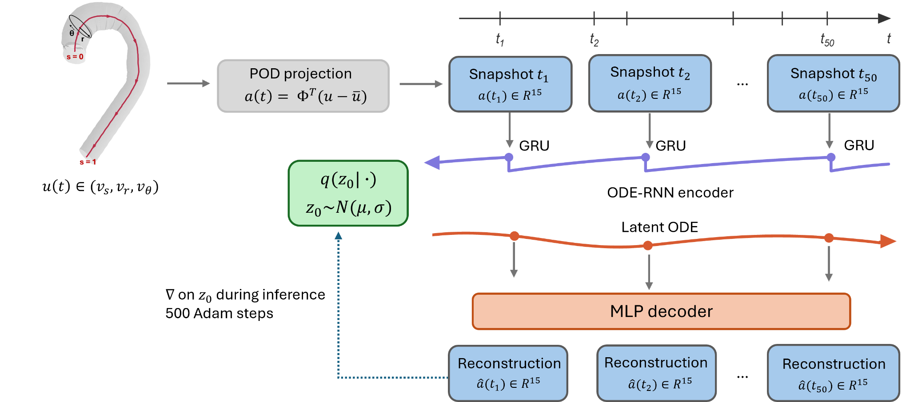
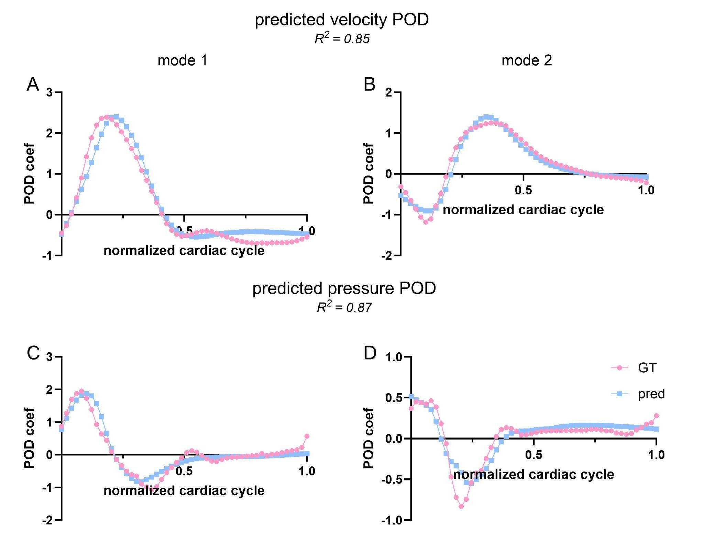
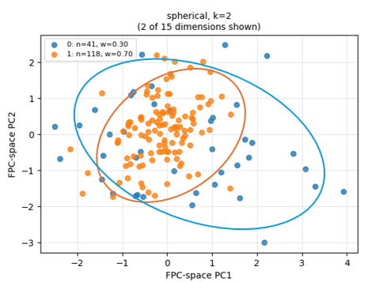
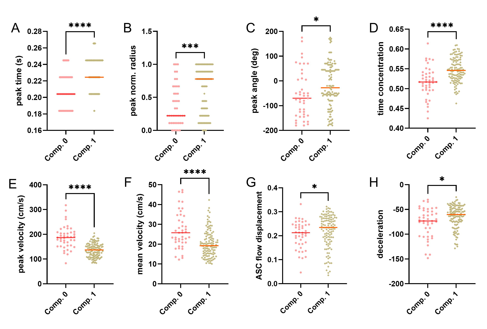
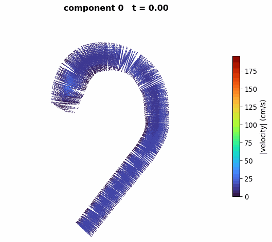
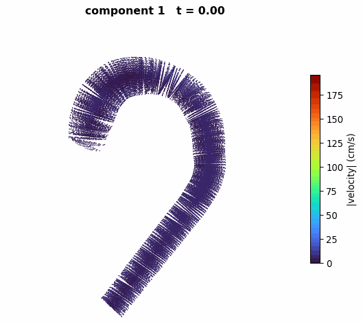

# AortaFlow

**A latent-ODE model of aortic blood flow — learning the whole velocity field, not just peak velocity.**

- Two distinct flow components found across 159 patients
- Manuscript in preparation
- Project page: https://violayfw.github.io/AortaFlow/
- Companion project: [Beyond Diameter](https://violayfw.github.io/beyond-diameter/), a generative shape model of the aorta

---

## The idea

Aortic stenosis is diagnosed mainly by peak velocity: the fastest speed blood reaches leaving the valve.

But patients with the same peak velocity do not have the same flow. Blood can hug the wall or stay central, peak early or late, stay organized or swirl. Disturbed flow acts on the aortic wall for years and is linked to dissection and thrombosis.

AortaFlow learns the **full 3D, time-varying velocity field**, then asks whether patients fall into distinct flow types.

## How it works

1. **POD projection** compresses each snapshot of the 3D flow field to 15 coefficients.
2. An **ODE-RNN encoder** reads the 50-snapshot sequence and infers the patient's initial latent state.
3. A **latent ODE** evolves that state in continuous time, so flow can be evaluated at any instant.
4. An **MLP decoder** maps the state back to POD coefficients, and then to a full velocity field.

At inference, z₀ is refined per patient with 500 Adam steps — no retraining needed for a new case.

## Accuracy

R² = 0.85 for velocity, R² = 0.87 for pressure, outperforming several baselines.

## Two flow components

Clustering the latent trajectories splits the cohort in two, with no labels used.

Component 1 is the slower group: lower peak velocity, lower mean velocity, gentler deceleration after the peak. On every other measure it is the higher one — the peak comes later, sits further from the center, arrives at a larger angle, is more concentrated in time, and comes with greater ascending flow displacement.

| Flow feature | Component 0 (n = 41) | Component 1 (n = 118) |
|---|---|---|
| Peak velocity | Higher | Lower |
| Mean velocity | Higher | Lower |
| Deceleration after peak | Steeper | Gentler |
| Time of peak | Earlier | Later |
| Peak radius | Nearer the center | Further out |
| Peak angle | Lower | Higher |
| Time concentration | Lower | Higher |
| ASC flow displacement | Smaller | Larger |

The slower group is not simply the milder group — patterns linked to long-term wall damage. Peak velocity alone puts both groups in the same box.

Decoded velocity fields for each component:

| Component 0 (n = 41) | Component 1 (n = 118) |
|---|---|
|  |  |

## Code

Code will be released with the publication.

## Author

**Yufan (Viola) Wu**, Yusuf A. Ozturk, Fanwei Kong, Jessica Wagenseil — Washington University in St. Louis — [LinkedIn](https://www.linkedin.com/in/viola-w-0440a3196/)
